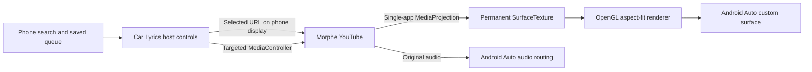

# Morphe playback on Android Auto

Updated October 2, 2026. This replaces the earlier hypothesis-only investigation: **the installed Morphe app's actual video has now been rendered on the desktop Android Auto head unit.** Physical Mazda testing remains outstanding.

## Current implementation

- **Morphe owns login and playback.** Car Lyrics launches `app.morphe.android.youtube` with an explicit YouTube URL, using application context and phone display 0. Using CarContext directly attempted to launch on Android Auto's private display and failed with SecurityException.
- **One consent, one projection, one virtual display.** Consent is consumed immediately by the foreground service. It is not cached or reused. Android requires new consent after the capture session stops.
- **Stable video input, replaceable car output.** Directly replacing the virtual display's output with each host surface produced black video. `MorpheVideoRenderer` keeps a permanent SurfaceTexture input and replaces only its EGL car output. It uses the SurfaceTexture transform matrix and aspect-fit scaling, capped at 1280 pixels on the capture's longest edge.
- **Morphe-specific controls.** Notification-listener access grants the app access to MediaSessionManager. Only the Morphe package is selected. No notification contents are read or retained. The car UI follows actual playback state; sending Pause alone does not claim that playback paused.
- **Host UI and video are separate.** Previous, Pause/Play, Next, and Browse are template actions. The mirrored YouTube UI itself is not wired to rotary input. Browsing keeps Morphe playback and capture alive.

## Observed checks

| Check | Result |
| --- | --- |
| Pixel 7a / Android 17 / Morphe 21.04.223 | Installed and used existing Morphe login |
| 1280×720 DHU | Actual karaoke video and lyrics visible; host retained Maps side panel |
| 800×480 DHU | Full app area with compact controls and aspect-fitted video |
| Select, pause, resume, manual next | Correct Morphe video/media state observed |
| Browse and surface replacement | Capture continues; renderer reattaches without fresh consent |
| Audio | Isolated DHU stream contained audio after correcting test mixer volume; measured peak −32.6 dBFS in a short sample |
| Rotary-only DHU | Focus did not respond reliably to CLI rotary commands; unresolved |
| Complete song | 3:54 karaoke video reached ENDED; Morphe subsequently autoplayed its own recommendation |
| Unit tests | 11 passed |
| Physical Mazda / measured A/V offset / voice | Not verified |

A screenshot of a valid surface or a PLAYING media state alone is not proof of video rendering. The desktop checks inspected actual captured lyric frames. Short screenshots and mixer checks do not establish an audio/video synchronization bound.

## Next milestones

1. **Rotary input and real Mazda:** resolve the DHU input issue, then repeat launch, browse, select, pause, Next, Back, and reconnect using the 2021 CX-5 Commander. Use the Play-installed release for launcher verification.
2. **Queue ownership:** disable or reconcile Morphe autoplay; detect actual video identity and completion; advance only through the selected Car Lyrics queue. Subscribe to live phone queue edits. Today Next/Previous operate on the selected list snapshot.
3. **Playback matrix:** test several karaoke providers, videos that reject embeds, long sessions, account/region restrictions, portrait videos, buffering, app switching, and locking. Capture quantitative A/V latency and recovery results. Do not promise all YouTube content.
4. **Larger lyrics:** preserve video edges; test optional user-controlled framing and the host's visible-area changes. The app cannot independently remove Android Auto's split-screen Maps panel.
5. **Morphe extension only if needed:** a version-specific Morphe patch could expose video ID, duration, position, seek, completion, fullscreen, and queue events directly. Start with a small explicit bridge rather than porting the entire patched APK. This is not implemented in 0.4.0.

The existing mirror is the shortest working route to the user's installed player. A Morphe APK fork remains a maintenance-heavy alternative: the project supplies patches for specific YouTube APK versions, not the full YouTube source tree.

## Sources

- [Morphe patches](https://github.com/MorpheApp/morphe-patches)
- [Android MediaProjection lifecycle and consent](https://developer.android.com/media/grow/media-projection)
- [MediaSessionManager access](https://developer.android.com/reference/android/media/session/MediaSessionManager)
- [Android Auto desktop head unit](https://developer.android.com/training/cars/testing/dhu)
- [Drawing on car surfaces](https://developer.android.com/training/cars/apps/library/draw-maps)
