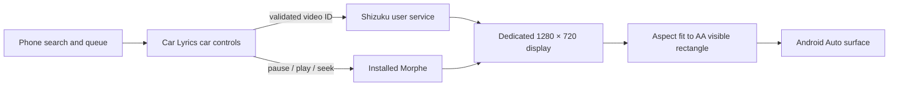

# Native Morphe rendering

## Implemented and tested — October 4, 2026

Car Lyrics **0.5.0 (16)** now includes an opt-in **Shizuku user service**. It runs the installed Morphe YouTube on a dedicated trusted virtual display and routes that display’s Surface through the existing OpenGL renderer to Android Auto. It does not use MediaProjection, reinstall Morphe, or copy account credentials. The phone still runs Morphe; no APK is installed into the Mazda itself.

### Pixel setup

Official Shizuku **13.6.0** is installed and paired with Android wireless debugging. Its server runs as shell UID 2000. **Car Lyrics Native Dev** is authorized, has Morphe media-session access, and has native mode enabled. Start-on-boot and the required secure-settings permission were configured earlier; the next actual reboot has not verified automatic startup. If the server is stopped, open Shizuku and use **Start** under wireless debugging.

Open **Car Lyrics Native Dev** in the desktop Android Auto launcher. For the physical Mazda, install the standard v16 release through Play and separately enable native mode/authorize **Car Lyrics**; Native Dev’s ADB installation and permissions do not transfer. See [real-vehicle installation](../README.md#install-for-the-physical-mazda). This separate package (`com.doomslug.carlyrics.dev`) preserves the Play-installed v14 and its data. Native Dev uses the navigation template as a private host experiment; karaoke is not a navigation app and this variant is not for Play submission. The standard release remains the existing POI prototype, with a different host layout.

Morphe’s existing **Settings → Player → Open videos in fullscreen mode → Landscape** setting is retained. Native mode opens the normal Morphe URL Activity on its own display. Opening Morphe directly on the phone can move its task; use **Repair picture** in Car Lyrics to reclaim the car display.

### Verified evidence

| Check | Result |
|---|---|
| Native video on Mazda DHU profile | Morphe karaoke frames rendered at 1280×480 active geometry with touch disabled |
| No screen sharing | `dumpsys media_projection` reported `null` during native playback |
| Separate phone and car | Morphe remained on its native display while Car Lyrics search or another phone screen was open |
| Phone queue → car playback | Queen search → Queue on phone → select Queen in car → matching native Morphe video |
| Rotary timeline seek | Selected 0:20; Morphe reported 20,000 ms |
| Repair picture | Knob action restarted Morphe, restored fullscreen and resumed at the saved 122,119 ms, without phone interaction or capture consent |
| Return from menus | Queue, search, playlists, Seek, Back, and Now playing preserve the playback session; regression tests repeat the menu cycles |
| Host restrictions | Browse, Queue, Seek, Back, Now playing tested with DHU `restrict all`; no block in those paths |
| Split dashboard | Host’s unoccluded visible rectangle controls aspect fit; video clears the right-hand media card |
| Focus ownership | Own-focus and no-steal-focus flags prevent Morphe from taking the phone/AA focus |
| Physical Mazda, locked phone, reboot, measured A/V sync | Still to verify |

[Player proof](images/native-v16-player.png) · [Knob seek proof](images/native-v16-seek.png) · [Queue proof](images/native-v16-queue.png)

### Implementation

- `NativeMorpheService.java`: shell-privileged Shizuku user service, fixed 1280×720@160 display. Only the owning app UID can call create/play/release. Video IDs are validated; the launch target is fixed to Morphe. No arbitrary command API is exposed. Binder death and explicit close release the display; display removal destroys its activities rather than moving them onto the passenger’s phone.
- `MorpheNativeDisplay.kt`: asynchronous bind/create/launch, latest pending selection, bind timeout, persistent input Surface, output replacement, and Repair picture. Creating a new native session and using Repair both restart only Morphe to reset its retained compact-layout state; media-session seek restores the saved time after the new process is ready, because a cold launch can ignore URL timestamps. The non-daemon helper belongs to the car app’s session.
- `MorpheScreenShare.kt`: common VideoPlayer adapter for native mode and projection backup; media session supplies playback state, time, and seek. A song selected before backup permission is granted starts once after approval.
- `VideoViewport.kt` / `MorpheVideoRenderer.kt`: aspect fit inside the host’s visible rectangle, preserving the entire frame in split mode. A stable 16:9 native input avoids phone-orientation changes resizing the car source.
- `CarLyricsScreen.kt`: one playback session shared by a real ScreenManager stack, persistent Now playing actions, resumed-screen status updates, knob-selectable timeline and Repair picture. This addresses template-stack mistakes that can consume AA’s task quota; it does not remove host restrictions.

The trusted/own-focus/no-steal/destroy-on-removal flags come from [AOSP DisplayManager](https://android.googlesource.com/platform/frameworks/base/+/refs/heads/android17-release/core/java/android/hardware/display/DisplayManager.java). The shell launch uses Android’s [multi-display activity policy](https://source.android.com/docs/core/display/multi_display/activity-launch). See [Shizuku user-service API](https://github.com/RikkaApps/Shizuku-API), [SurfaceCallback visible-area rules](https://developer.android.com/reference/androidx/car/app/SurfaceCallback), and [Screen task quota/back behavior](https://developer.android.com/reference/androidx/car/app/Screen).

### Remaining gates

1. Repeat reconnect, aspect fit and Commander navigation on the actual Mazda; confirm screen geometry/density. Expanded app view is host-controlled, and split view remains supported.
2. Verify Shizuku restart after reboot, lock/screen-off behavior, service death and permission loss. Hidden privileged APIs make future Android versions an explicit compatibility gate.
3. Measure audio/video offset with a known sync reference. Morphe supplies the original audio and video; native rendering adds its own frame path.
4. Automatic queue advancement and ownership of Morphe’s autoplay remain unfinished. Manual Next/Previous follow the list selected in Car Lyrics; new phone queue additions require reopening Queue and selecting it again.
5. Repeat car voice recognition against native playback with a real cabin microphone. V14 DHU voice recognition and the shared submitted-query → result → player code are verified; the phone microphone and cabin acoustics are not.

No guarantee is made for every YouTube video or public Play eligibility. Account/region restrictions and Morphe’s own playback limitations still apply. The earlier standalone display probe is retained in [tools/native-display-probe](../tools/native-display-probe/README.md).

## Alternative: patch Morphe to output video directly

If the helper's reboot/setup cost is unacceptable, the other credible route is a Morphe add-on patch that redirects the actual video output Surface. That would keep decoding/audio/authentication in Morphe and use a tightly scoped service to receive Car Lyrics' output Surface and commands. It would require rebuilding/re-signing a compatible patched APK and testing playback lifecycle.

Source inspection of upstream Morphe v1.45.0 (`7387cc19e7d43b5dc35c6ecbfac0bbc2282a094e`) found:

- [`AddOnManager`](https://github.com/MorpheApp/morphe-patches/blob/7387cc19e7d43b5dc35c6ecbfac0bbc2282a094e/extensions/youtube/src/main/java/app/morphe/extension/youtube/addon/AddOnManager.java) registers add-ons inserted **at patch time**. It does not dynamically install an add-on into the currently signed APK.
- [`AddOnApi`](https://github.com/MorpheApp/morphe-patches/blob/7387cc19e7d43b5dc35c6ecbfac0bbc2282a094e/extensions/youtube/src/main/java/app/morphe/extension/youtube/addon/AddOnApi.java) exposes video ID, playback-time, state, and player-view events. Those would help queue synchronization, but no external video-Surface API was found.
- `VideoInformation` exposes seek/time/quality interfaces into YouTube's obfuscated player. `FullscreenVideoScalePatch` locates its SurfaceView/TextureView to transform the view; this is not an existing external-display bridge.
- The installed APK has 13 `MediaCodec.configure(...)` call sites and 3 `MediaCodec.setOutputSurface(...)` call sites. These are potential instrumentation points, **not 16 proven playback hooks**. Audio codecs, encoders, preview players, adaptive switches, and secure outputs must be distinguished. A direct patch must follow the player thread/lifecycle and handle output changes rather than replace every Surface argument indiscriminately.

Use the [MediaCodec output-Surface API](https://developer.android.com/reference/android/media/MediaCodec#setOutputSurface(android.view.Surface)) as the underlying mechanism, after tracing the actual active video renderer. The isolated MediaPlayer probe validates only generic native Surface transport. It does not prove a YouTube decoder patch.

Morphe's “Automotive” form-factor setting changes YouTube's layout; it does not supply Android Auto hosting or display-launch privileges. Upstream patches are version-specific, and installed YouTube 21.04.223 is not listed in the current v1.45.0 supported-base list. A replacement with a different signing key cannot preserve the current package by an ordinary in-place update. Prefer a separately packaged experiment or the existing legitimate signing workflow; keep account tokens within Morphe/GmsCore. The native helper route above avoids that APK/signing work entirely.
