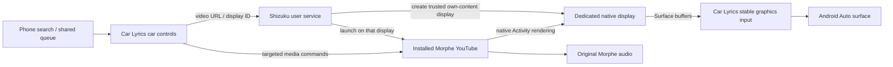

# Native Morphe rendering investigation

Investigated October 2, 2026. **A native-display proof of concept worked on the connected Pixel 7a.** The installed Morphe app played karaoke video on a separate display, with no MediaProjection active. This is a separate research APK; Car Lyrics 0.4.0 still uses its existing screen-sharing implementation. Native rendering on the Android Auto DHU and physical Mazda has not yet been tested.

## Recommendation

Build a **Shizuku-backed native display host** for Car Lyrics. Keep the installed Morphe APK, its playback engine, and its account data. A helper running with the user's authorized ADB shell privileges creates a private trusted virtual display and launches Morphe's normal URL Activity on it. That display renders into a Surface supplied by Car Lyrics.

The phone still runs Morphe; the Mazda displays its output through Android Auto. This does not install YouTube into the Mazda's operating system. Unlike the current capture backend, the display contains a real Morphe Activity rendered at its own resolution and does not copy the phone display or consume a screen-sharing token.

The diagram is the proposed integration. The probe currently supplies a phone SurfaceView in place of the Car Lyrics graphics input/Android Auto surface, and uses an ADB-launched helper in place of Shizuku.

## What was actually tested

Environment: Pixel 7a, Android 17/API 37; installed `app.morphe.android.youtube` 21.04.223. No replacement of Morphe, app-data clearing, credential copying, rooting, or account setup was performed.

| Experiment | Observed result |
| --- | --- |
| Ordinary app launches its own Activity on its own private virtual display | `SecurityException`; launch preflight false |
| Same experiment with `allowEmbedded=true`, after showing a Presentation | Still denied; the Presentation itself rendered |
| Ordinary app preflights installed Morphe on that display | False |
| ADB launches installed Morphe on that untrusted display | Existing player rendered and played moving karaoke lyric frames |
| Open a new video through Morphe's URL Activity on the untrusted display | Internal player redirect rejected by WindowManager; returned to phone |
| Shell helper creates private `OWN_CONTENT_ONLY | TRUSTED` display | Succeeded as UID 2000; resulting Display flags 132 (PRIVATE + TRUSTED) |
| Open “Mariah Carey - Emotions” (`G9LQ3HWPB2Q`) on that display | Actual lyric frames visible; Morphe media session PLAYING |
| Change to “Yasuha - Fly-day Chinatown” (`j5FH4FfRxFA`) by URL | New video played; Morphe stayed on the same native display |
| Pause / resume using media keys | Morphe state changed to PAUSED and back to PLAYING |
| Capture state during native tests | `dumpsys media_projection` reported `null` |
| Separate-process MediaPlayer writes to a Binder-delivered Surface | Synthetic video rendered without projection; supports surface transport feasibility |
| Shizuku installation / authorization / actual user-service integration | Not tested |
| Native backend on DHU / 2021 Mazda / Commander knob | Not tested |
| Native-backend audio routing and measured A/V synchronization | Not measured in this experiment |

The successful native Morphe run used display 276 at 800×400. Display IDs are temporary. The phone's display 0 continued showing the probe while Morphe's Activity was resumed on display 276. [Native Morphe screenshot](images/native-morphe-proof.png). [Reproducible probe source and commands](../tools/native-display-probe/README.md).

Existing screen sharing was stopped to establish the no-capture result. The app-owned receiver is deliberately minimal and loses its Surface when its phone Activity is hidden; this is not the production lifecycle design.

## Why the helper matters

Android applies additional launch restrictions to untrusted virtual displays. Owning a display is not enough to run arbitrary Activities, and `allowEmbedded` alone did not make the probe launchable. The AOSP launch-policy implementation checks embedding and privileged permissions before its private-display owner check. See [AOSP activity launch policy](https://source.android.com/docs/core/display/multi_display/activity-launch) and [ActivityTaskSupervisor](https://android.googlesource.com/platform/frameworks/base/+/refs/heads/main/services/core/java/com/android/server/wm/ActivityTaskSupervisor.java).

On this Pixel, the ADB shell holds `INTERNAL_SYSTEM_WINDOW`, `ACTIVITY_EMBEDDING`, `ADD_TRUSTED_DISPLAY`, and `INJECT_EVENTS`. The native helper used that existing authorized development access. It created a trusted display, which allowed Morphe's internal navigation to remain there. The [display flags are defined in AOSP](https://android.googlesource.com/platform/frameworks/base/+/refs/heads/main/core/java/android/hardware/display/DisplayManager.java); no auto-mirroring flag or MediaProjection was used.

[Shizuku's user-service API](https://github.com/RikkaApps/Shizuku-API) is the proposed way to perform those operations on the phone without keeping this computer connected. This is an inference from the successful shell-process experiment, not a completed Shizuku integration. Its [setup guide](https://shizuku.rikka.app/guide/setup/) describes operation without root using wireless debugging and notes that it must be started again after reboot. Thus this approach trades repeated screen-sharing consent for helper setup/authorization and restart after phone reboot. Do not promise a completely unattended reconnect until tested.

## Implementation plan and acceptance gates

1. **Integrate the helper and a persistent output.** Add an opt-in native backend using a Shizuku user service. Pass a Surface over explicit Binder IPC and perform display creation/launch inside the shell process. Reuse the permanent SurfaceTexture/OpenGL input pattern from `MorpheVideoRenderer`, with native display dimensions instead of capture dimensions. Keep the input alive while AA replaces its output Surface. The probe's ContentProvider and shell commands are research plumbing, not the production API. Gate: native Morphe lyric frames visible on the 800×480 DHU, projection state null, phone free to show Car Lyrics.
2. **Video selection and queue ownership.** Send validated YouTube video IDs to an explicit Morphe URL component, always on the current helper-owned display. Keep passenger search and queue edits in Car Lyrics; opening Morphe on the phone may move its existing task away from the car. Subscribe to the shared queue and reconcile actual media state. Gate: select three videos, Next/Previous, change queue from phone, and verify playback identity/display after every change. Completion/autoplay ownership remains a separate problem; native rendering alone does not solve it.
3. **Commander controls.** Keep car browsing, search results, queue, play/pause, and Next/Previous as Android Auto template actions. Target Morphe's MediaController for transport commands. Use helper input directed at the native display only where needed for player controls. Morphe's phone UI is not automatically rotary-friendly. Gate: complete a selection/playback/queue flow using DHU rotary input without touching the phone, then repeat on the Mazda.
4. **Session recovery and audio.** Verify aspect fit, visible-area changes, display resize, AA reconnect, process death, helper permission loss, locking, screen off, audio focus, and a full song. Handle helper unavailability visibly. Measure A/V offset with a known sync reference before making a synchronization claim. Keep secure/DRM content on supported outputs; this work is not evidence that every YouTube video will play.

Validate caller identity in the production bridge, scope operations to Morphe/current display, and release the display/Surface when the session ends. Hidden APIs and privileges make Android updates an explicit compatibility gate. No public Play-release claim follows from this prototype. The existing car-surface API is documented for map-based app categories, and Google's [parked Android Auto guide](https://developer.android.com/training/cars/parked/auto) still lists games as its currently supported parked category when checked; native video availability on the 2021 Mazda has not been established through that official app route.

## Alternative: patch Morphe to output video directly

If the helper's reboot/setup cost is unacceptable, the other credible route is a Morphe add-on patch that redirects the actual video output Surface. That would keep decoding/audio/authentication in Morphe and use a tightly scoped service to receive Car Lyrics' output Surface and commands. It would require rebuilding/re-signing a compatible patched APK and testing playback lifecycle.

Source inspection of upstream Morphe v1.45.0 (`7387cc19e7d43b5dc35c6ecbfac0bbc2282a094e`) found:

- [`AddOnManager`](https://github.com/MorpheApp/morphe-patches/blob/7387cc19e7d43b5dc35c6ecbfac0bbc2282a094e/extensions/youtube/src/main/java/app/morphe/extension/youtube/addon/AddOnManager.java) registers add-ons inserted **at patch time**. It does not dynamically install an add-on into the currently signed APK.
- [`AddOnApi`](https://github.com/MorpheApp/morphe-patches/blob/7387cc19e7d43b5dc35c6ecbfac0bbc2282a094e/extensions/youtube/src/main/java/app/morphe/extension/youtube/addon/AddOnApi.java) exposes video ID, playback-time, state, and player-view events. Those would help queue synchronization, but no external video-Surface API was found.
- `VideoInformation` exposes seek/time/quality interfaces into YouTube's obfuscated player. `FullscreenVideoScalePatch` locates its SurfaceView/TextureView to transform the view; this is not an existing external-display bridge.
- The installed APK has 13 `MediaCodec.configure(...)` call sites and 3 `MediaCodec.setOutputSurface(...)` call sites. These are potential instrumentation points, **not 16 proven playback hooks**. Audio codecs, encoders, preview players, adaptive switches, and secure outputs must be distinguished. A direct patch must follow the player thread/lifecycle and handle output changes rather than replace every Surface argument indiscriminately.

Use the [MediaCodec output-Surface API](https://developer.android.com/reference/android/media/MediaCodec#setOutputSurface(android.view.Surface)) as the underlying mechanism, after tracing the actual active video renderer. The isolated MediaPlayer probe validates only generic native Surface transport. It does not prove a YouTube decoder patch.

Morphe's “Automotive” form-factor setting changes YouTube's layout; it does not supply Android Auto hosting or display-launch privileges. Upstream patches are version-specific, and installed YouTube 21.04.223 is not listed in the current v1.45.0 supported-base list. A replacement with a different signing key cannot preserve the current package by an ordinary in-place update. Prefer a separately packaged experiment or the existing legitimate signing workflow; keep account tokens within Morphe/GmsCore. The native helper route above avoids that APK/signing work entirely.
